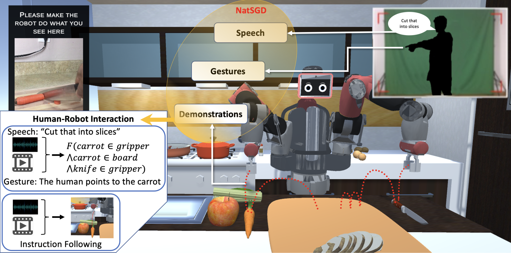
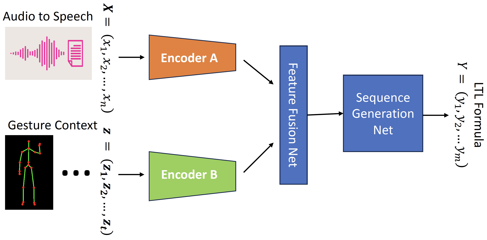

<!-- omit from toc -->
# NatSGD Comm2LTL
NatSGD Dataset Human Communication to Linear Temporal Logic (Comm2LTL) Benchmarking: This repository contains the implementation and models for translating human communication into Linear Temporal Logic (LTL).



<!-- omit from toc -->
#### Contents
- [1. Download Dataset files](#1-download-dataset-files)
- [2. Pre-Training Gesture Encoder](#2-pre-training-gesture-encoder)
- [3. Fine-Tuning Speech and Gesture Models](#3-fine-tuning-speech-and-gesture-models)
  - [3.1. Speech Only Models](#31-speech-only-models)
  - [3.2. Gesture Only Models](#32-gesture-only-models)
  - [3.3. Speech + Gesture Models](#33-speech--gesture-models)
- [4. Spot Score Calculation](#4-spot-score-calculation)
- [5. Results](#5-results)


## 1. Download Dataset files
Download dataset files from this [Google Drive](https://drive.google.com/drive/folders/1SGvPDvxQyZfEIoVVi9REXRUEinp5g0Tr) link into the `data` folder.

## 2. Pre-Training Gesture Encoder
Before the fine-tuning the models, we need to train the gesture Autoencoder. Below are the steps to prepare data and pre

To prepare the LSTM encoder model for gesture preprocessing in our projects, take the following steps:

1. Run the `lstmencoder.py` script.
2. This will generate a `.pth` file that we will use later as the gesture motion encoding for the downstream tasks.

## 3. Fine-Tuning Speech and Gesture Models

We have to fine-tune two distinct models, namely `bart-base` and `t5-base`, on our dataset across three modalities: Speech only, Gesture only, and a combination of Speech and Gestures.


The learning framework for translating a pair of speech and gesture data to an LTL formula that can solve multi-modal human task understanding problems.

### 3.1. Speech Only Models

For the Speech-only model, please see:

- [speech_bart.py](speech_bart.py)
- [speech_t5.py](speech_t5.py)

### 3.2. Gesture Only Models

For the Gesture-only model, please see:

- [gestures_bart.py](gestures_bart.py)
- [gestures_t5.py](gestures_t5.py)

### 3.3. Speech + Gesture Models

To explore the Speech and Gesture combined model, please see:

- [speechGestures_bart.py](speechgestures_bart.py)
- [speechGestures_t5.py](speechGestures_t5.py)

## 4. Spot Score Calculation

In order to calculate the Spot Score, you will follow the steps below and use [calc_spot_score.py](calc_spot_score.py) file.

1. Update the input folder and file name in the code according to your specific dataset and file structure. E.g. Here we have Speech + Gestures T5 test predictions for epoch 100's model.
```
input_folder = os.getcwd() + '/results/predictions/speechGesturesT5/test'
input_file =  input_folder + '/test_data_epoch_100.txt'
```

2. Run `calc_spot_score.py` to compute the total score for this prediction set.

## 5. Results

| Model (using BART)   | Jaq Sim &uarr; | Spot Score &uarr; |
| :------------------- | :-------: | ----------: |
| Speech Only          |   0.934   |    0.434    |
| Gestures Only        |   0.922   |    0.299    |
| Speech + Gestures    | **0.944** |  **0.588**  |

| Model (using T5)   | Jaq Sim &uarr; | Spot Score &uarr; |
| :------------------- | :-------: | ----------: |
| Speech Only          |   0.917   |    0.299    |
| Gestures Only        |   0.948   |    0.244    |
| Speech + Gestures    | **0.961** |  **0.507**  |


For any additional information or inquiries, please feel free to contact us. Thank you for using NatSGD dataset and Comm2LTL benchmarking!
